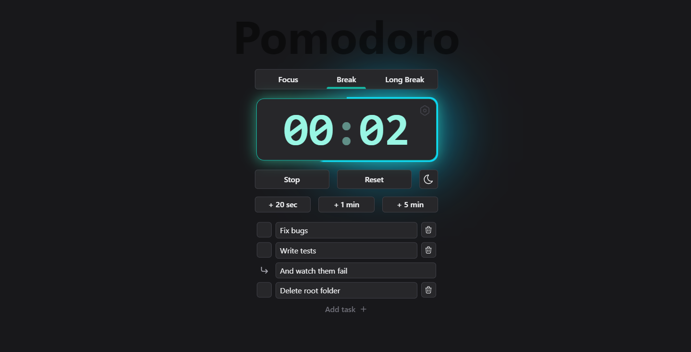

# Pomodoro Timer
The Pomodoro Timer is a simple yet powerful tool designed to enhance productivity and create a more focused work environment. Inspired by the Pomodoro Technique, this timer helps you break down your work into manageable intervals, allowing you to work with laser-like focus and take regular breaks to recharge.



## Key Features
- **Flexible Timer**: The timer is set to a default work session of 25 minutes followed by a 5-minute break. After completing 4 work sessions, the break is extended to 15 minutes. However, you have the flexibility to customize the timer duration according to your preferences.
- **Task List**: Stay organized and track your tasks with the built-in task list feature. Add, edit, and prioritize your tasks, ensuring that you stay on top of your work and maximize your productivity.
- **Dark and Light Theme**: Customize the appearance of the timer with a choice of dark and light themes. Whether you prefer a sleek and modern look or a softer and more calming ambiance, the Pomodoro Timer adapts to your visual preferences.
- **Sound Effects (*Coming Soon*)**: Immerse yourself in a focused work environment with optional sound effects. Choose from a selection of soothing sounds to help you stay in the zone and maintain your concentration.
- **Statistics Charts (*Coming Soon*)**: Gain valuable insights into your work habits and productivity with detailed statistics charts. Visualize your work sessions, breaks, and task completion rates, empowering you to analyze your performance and make informed adjustments.
- **Notification System (*Coming Soon*)**: Never miss a work session or break with the Pomodoro Timer's notification system. Receive timely reminders and alerts, ensuring that you stay on track and maintain a consistent work rhythm.
- **Task Groups (*Coming Soon*)**: Organize your tasks into groups or categories, allowing you to focus on specific projects or areas of work. Easily switch between task groups, streamlining your workflow and increasing efficiency.
- **Save Settings Presets Locally (*Coming Soon*)**: Save your preferred timer settings as presets, making it effortless to switch between different work routines or share your preferred configurations with others.

## Technologies Used
The Pomodoro Timer project is built using the following technologies:

- **React**: A popular JavaScript library for building user interfaces, providing a robust and efficient foundation for the timer's frontend.
- **Zustand**: A state management library for React, enabling seamless data flow and efficient state updates within the timer application.
- **Vite**: A fast and lightweight build tool for modern web applications, ensuring quick development and optimized performance.
- **Yarn**: A package manager that allows for efficient dependency management and ensures consistent and reliable installations.
- **Tailwind CSS**: A utility-first CSS framework that provides a comprehensive set of pre-built styles and components, enabling rapid and responsive UI development.

## Run locally
To run this project locally, install it using npm:
```
npm install
```
Then run it with:
```
npm run dev
```
You can also run linting and testing with:
```
npm run lint
npm run test
```
## License
The Pomodoro Timer is open-source software licensed under the [MIT License](./LICENSE). Feel free to use, modify, and distribute the timer according to the terms of the license.

## Contact
For any questions, feedback, or support requests, please contact me at [technotche@gmail.com](technotche@gmail.com) or leave an issue in this repository.

## TODO
- [x] Go from setInterval to Date to remove reliance on intervals and asynchronous code + allow timer to go while device is in sleep
- [x] Setup localStorage migration pipeline
- [x] BUG: Starting timer after 0:0 and adding some time to it results in adding this time to maxTime
- [x] Rewrite interval instantiation to ensure that only one istance is running at a time
- [x] Add screen awaking feature to keep timer on screen
- [x] Extract tasks into components
- [ ] Add eslint and prettier then add vscode actions on save
- [ ] Clean up before making repo public
- [ ] Add footer to with Copyright and project repo link
- [ ] Extends tasks to support description
- [ ] Add some task UI on hover - options  
- [ ] Add CI/CD with github actions
- [ ] Add DnD for tasks
- [ ] BUG: Set interval stops after some time while working on another tab
- [ ] Fix first second being missed on launch
- [ ] Refactor first time 
  - [ ] Sparate styles from component 
  - [ ] Decompose components into multiple smaller ones 
- [ ] Setup some E2E tests with playwright
- [ ] All uncomplited in [features](##Features)